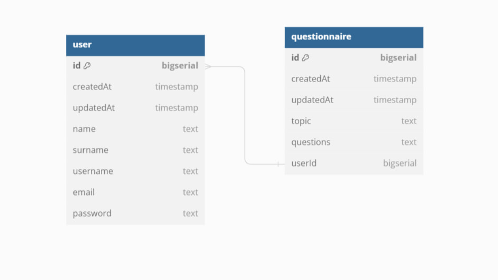

# Student
22B030305 Amanzholova Amina

# Social media as Questionnaires

This is a simple app where everyone can create profile with their own questionnaires.

## API structure

### Endpoints:

### Users
+ ```POST /api/v1/register:``` Register a new user.
+ ```GET /api/v1/users:``` Get all users.
+ ```GET /api/v1/users/{userId}:``` Get a user by ID.
+ ```PUT /api/v1/users/{userId}:``` Update a user by ID.

### Questionnaires
+ ```POST /api/v1/questionnaires:``` Create a new questionnaire.
+ ```GET /api/v1/questionnaires:``` Get all questionnaires.
+ ```GET /api/v1/questionnaires/{questionnairesId}:``` Get a questionnaire by ID.
+ ```PUT /api/v1/questionnaires/{questionnairesId}:``` Update a questionnaire by ID.
+ ```DELETE /api/v1/questionnaires/{questionnairesId}:``` Delete a questionnaire by ID.

## DB structure



```
Table user {
  id bigserial [primary key]
  createdAt timestamp
  updatedAt timestamp
  name text
  surname text
  username text
  email text
  password text
}

Table questionnaire {
  id bigserial [pk]
  createdAt timestamp
  updatedAt timestamp
  topic text
  questions text
  userId bigserial
}

Ref: questionnaire.userId < user.id
```


## Installation